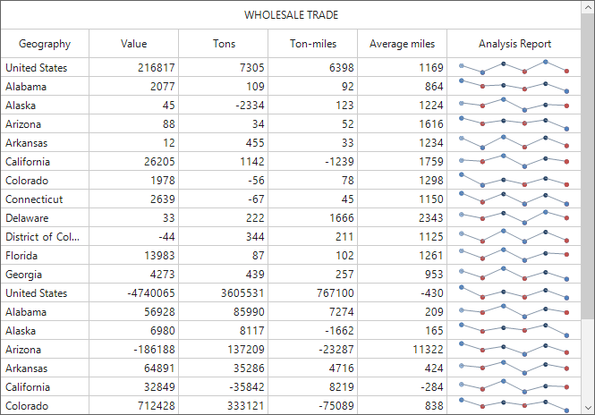

# How to Create Custom Column in WinForms DataGrid?

This repositories contains the samples to create custom column in [WinForms DataGrid](https://www.syncfusion.com/winforms-ui-controls/datagrid) (SfDataGrid).

You can create a new column by deriving [GridColumn](https://help.syncfusion.com/cr/windowsforms/Syncfusion.WinForms.DataGrid.GridColumn.html) and create new a cell renderer by overriding the predefined renderer in DataGrid. The following steps describe how to create a sparkline column as a custom column.

### Creating custom column

You can create a custom column by overriding a new class from the **GridColumn** class.

#### C#
``` csharp
public class GridSparklineColumn : GridColumn
{
    /// <summary>
    /// Initializes a new instance of the <see cref="GridSparklineColumn"/> class.
    /// </summary>
    public GridSparklineColumn()
    {
        SetCellType("Sparkline");
        this.SparklineType = SparkLineType.Line;
    }

    /// <summary>
    /// Gets or sets the type of the sparkline control.
    /// </summary>
    public SparkLineType SparklineType { get; set; }
}
```
#### VB
``` vb
Public Class GridSparklineColumn
	Inherits GridColumn
	''' <summary>
	''' Initializes a new instance of the <see cref="GridSparklineColumn"/> class.
	''' </summary>
	Public Sub New()
		SetCellType("Sparkline")
		Me.SparklineType = SparkLineType.Line
	End Sub

	''' <summary>
	''' Gets or sets the type of the sparkline control.
	''' </summary>
	Public Property SparklineType() As SparkLineType
End Class
```

### Creating renderer

After creating a custom column, you need to create renderer for the custom column. You can create custom renderer by deriving the [GridCellRendererBase](https://help.syncfusion.com/cr/windowsforms/Syncfusion.Windows.Forms.Grid.GridCellRendererBase.html) class.

#### C#
``` csharp
/// <summary>
/// Represents a class that used for drawing the spark line cell.
/// </summary>
public class GridSparklineCellRenderer : GridCellRendererBase
{
/// <summary>
/// Initializes a new instance of the <see cref="GridSparklineCellRenderer"/> class.
/// </summary>
/// <param name="sparkline">The sparkline.</param>
/// <param name="dataGrid">The DataGrid.</param>
public GridSparklineCellRenderer(Syncfusion.Windows.Forms.Chart.SparkLine sparkline, SfDataGrid dataGrid)
{
    Sparkline = sparkline;
    DataGrid = dataGrid;
    IsEditable = false;
}
       
/// <summary>
/// Gets or sets to specify the datagrid.
/// </summary>
protected SfDataGrid DataGrid { get; set; }

/// <summary>
/// Gets the sparkline control used to draw the sparkline.
/// </summary>
protected SparkLine Sparkline { get; set; }

///<summary>
///Renders the line type sparkline.
///</summary>
///<param name="graphics">The <see cref="System.Windows.Forms.PaintEventArgs"/> instance containing the event data.</param>
///<param name="sparkline">The Sparkline.</param>
public void DrawSparkline(Graphics graphics, Syncfusion.Windows.Forms.Chart.SparkLine sparkline)
{
    SparkLineSource sparkLineSource = new SparkLineSource();
    int areaMarginX = 3;
    int areaMarginY = 3;
    double firstPointX = 0, firstPointY = 0, secondPointX = 0, secondPointY = 0;
    double areaWidth = sparkline.ControlWidth - areaMarginX * areaMarginX;
    double areaHeight = sparkline.ControlHeight - areaMarginY * areaMarginY;

    var sourceList = (List<object>)sparkLineSource.GetSourceList(sparkline.Source, sparkline);

    if (sourceList.Count == 0)
        return;

    double lineInterval = areaWidth / (sourceList.Count);
    double lineRange = sparkline.HighPoint - sparkline.LowPoint;

    for (int i = 0; i < sourceList.Count; i++)
    {
        double Value = Convert.ToDouble(sourceList[i]) - sparkline.LowPoint;

        secondPointX = firstPointX;
        secondPointY = firstPointY;

        firstPointX = this.Sparkline.Location.X + (lineInterval * i + (lineInterval / 2));
        firstPointY = this.Sparkline.Location.Y + (areaHeight - (areaHeight * (Value / lineRange)));

        if (i > 0)
            graphics.DrawLine(new Pen(sparkline.LineStyle.LineColor, 1), (float)(areaMarginX + firstPointX), (float)(areaMarginY + firstPointY), (float)(areaMarginX + secondPointX), (float)(areaMarginY + secondPointY));

        if (sparkline.Markers.ShowMarker)
            graphics.FillEllipse(new SolidBrush(sparkline.Markers.MarkerColor.BackColor), (float)(areaMarginX + firstPointX - 2), (float)(areaMarginY + firstPointY - 2), 5, 5);
        if (Convert.ToDouble(sourceList[i]) == sparkline.StartPoint && sparkline.Markers.ShowStartPoint)
            graphics.FillEllipse(new SolidBrush(sparkline.Markers.StartPointColor.BackColor), (float)(areaMarginX + firstPointX - 2), (float)(areaMarginY + firstPointY - 2), 5, 5);
        if (Convert.ToDouble(sourceList[i]) == sparkline.EndPoint && sparkline.Markers.ShowEndPoint)
            graphics.FillEllipse(new SolidBrush(sparkline.Markers.EndPointColor.BackColor), (float)(areaMarginX + firstPointX - 2), (float)(areaMarginY + firstPointY - 2), 5, 5);

        if (sparkline.GetNegativePoint() != null)
        {
            int count = sparkline.GetNegativePoint().GetUpperBound(0);
            for (int k = 0; k <= count; k++)
            {
                if (Convert.ToDouble(sourceList[i]) == (double)sparkline.GetNegativePoint().GetValue(k) && sparkline.Markers.ShowNegativePoint)
                    graphics.FillEllipse(new SolidBrush(sparkline.Markers.NegativePointColor.BackColor), (float)(areaMarginX + firstPointX - 2), (float)(areaMarginY + firstPointY - 2), 5, 5);
            }
        }

        if (Convert.ToDouble(sourceList[i]) == sparkline.HighPoint && sparkline.Markers.ShowHighPoint)
            graphics.FillEllipse(new SolidBrush(sparkline.Markers.HighPointColor.BackColor), (float)(areaMarginX + firstPointX - 2), (float)(areaMarginY + firstPointY - 2), 5, 5);
        if (Convert.ToDouble(sourceList[i]) == sparkline.LowPoint && sparkline.Markers.ShowLowPoint)
            graphics.FillEllipse(new SolidBrush(sparkline.Markers.LowPointColor.BackColor), (float)(areaMarginX + firstPointX - 2), (float)(areaMarginY + firstPointY - 2), 5, 5);
    }
}

/// <summary>
/// Override to draw the spark line of the cell.
/// </summary>
/// <param name="graphics">The <see cref="T:System.Drawing.Graphics"/> that used to draw the spark line.</param>
/// <param name="cellRect">The cell rectangle.</param>
/// <param name="cellValue">The cell value.</param>
/// <param name="style">The CellStyleInfo of the cell.</param>
/// <param name="column">The DataColumnBase of the cell.</param>
/// <param name="rowColumnIndex">The row and column index of the cell.</param>
protected override void OnRender(Graphics graphics, Rectangle cellRect, string cellValue, CellStyleInfo style, DataColumnBase column, RowColumnIndex rowColumnIndex)
{
    using (SolidBrush brush = new SolidBrush(style.BackColor))
        graphics.FillRectangle(brush, cellRect);

    var sparklineColumn = column.GridColumn as GridSparklineColumn;
    this.Sparkline = new Syncfusion.Windows.Forms.Chart.SparkLine();
    var record = this.DataGrid.GetRecordAtRowIndex(rowColumnIndex.RowIndex);

    this.Sparkline.Source = GetSparklineSource(column.GridColumn.MappingName, record);
    this.Sparkline.Type = sparklineColumn.SparklineType;
    this.Sparkline.Markers.ShowEndPoint = true;
    this.Sparkline.Markers.ShowHighPoint = true;
    this.Sparkline.Markers.ShowLowPoint = true;
    this.Sparkline.Markers.ShowMarker = true;
    this.Sparkline.Markers.ShowNegativePoint = true;
    this.Sparkline.Markers.ShowStartPoint = true;
    this.Sparkline.Size = cellRect.Size;
    this.Sparkline.Location = cellRect.Location;

    var smoothingMode = graphics.SmoothingMode;
    var clipBounds = graphics.VisibleClipBounds;
    graphics.SetClip(cellRect);
    graphics.SmoothingMode = System.Drawing.Drawing2D.SmoothingMode.HighQuality;
    if (this.Sparkline.Type == SparkLineType.Line)
        DrawSparkline(graphics, Sparkline);
    else if (this.Sparkline.Type == SparkLineType.Column)
        DrawSparkColumn(graphics, Sparkline);
    else
        DrawSparkWinLossColumn(graphics, Sparkline);

    graphics.SmoothingMode = smoothingMode;
    graphics.SetClip(clipBounds);
}

/// <summary>
/// Occurs when a key is pressed while the cell has focus.
/// </summary>
/// <param name="dataColumn">The DataColumnBase of the cell.</param>
/// <param name="rowColumnIndex">The row and column index of the cell.</param>
/// <param name="e">The <see cref="T:System.Windows.Forms.KeyEventArgs"/> that contains the event data.</param>
protected override void OnKeyDown(DataColumnBase dataColumn, RowColumnIndex rowColumnIndex, KeyEventArgs e)
{
    var selectionController = this.DataGrid.SelectionController as CustomSelectionController;
    switch (e.KeyCode)
    {
        case Keys.Space:
        case Keys.Down:
        case Keys.Up:
        case Keys.Left:
        case Keys.Right:
        case Keys.Enter:
        case Keys.PageDown:
        case Keys.PageUp:
        case Keys.Tab:
        case Keys.Home:
        case Keys.End:
            selectionController.HandleKeyOperations(e);
            break;
    }

    base.OnKeyDown(dataColumn, rowColumnIndex, e);
}

/// <summary>
/// Gets data to the sparkline column.
/// </summary>
/// <param name="mappingName">The mapping name of the column.</param>
/// <param name="record">Data of the SparkLine.</param>
/// <returns>returns collection.</returns>
private double[] GetSparklineSource(string mappingName, object record)
{
    var salesCollection = record as System.Data.DataRowView;
    var item = salesCollection.Row.ItemArray[5];
    return item as double[];
}
```
#### VB
``` vb
''' <summary>
''' Represents a class used for drawing the sparkline cell.
''' </summary>
Public Class GridSparklineCellRenderer
	Inherits GridCellRendererBase
''' <summary>
''' Initializes a new instance of the <see cref="GridSparklineCellRenderer"/> class.
''' </summary>
''' <param name="sparkline">The sparkline.</param>
''' <param name="dataGrid">The DataGrid.</param>
Public Sub New(ByVal sparkline As Syncfusion.Windows.Forms.Chart.SparkLine, ByVal dataGrid As SfDataGrid)
	Me.Sparkline = sparkline
	Me.DataGrid = dataGrid
	IsEditable = False
End Sub

''' <summary>
''' Gets or sets to specify the datagrid.
''' </summary>
Protected Property DataGrid() As SfDataGrid

''' <summary>
''' Gets the sparkline control used to draw the sparkline.
''' </summary>
Protected Property Sparkline() As SparkLine

'''<summary>
'''Renders the line type sparkline.
'''</summary>
'''<param name="graphics">The <see cref="System.Windows.Forms.PaintEventArgs"/> instance containing the event data.</param>
'''<param name="sparkline">The Sparkline.</param>
Public Sub DrawSparkline(ByVal graphics As Graphics, ByVal sparkline As Syncfusion.Windows.Forms.Chart.SparkLine)
	Dim sparkLineSource As New SparkLineSource()
	Dim areaMarginX As Integer = 3
	Dim areaMarginY As Integer = 3
	Dim firstPointX As Double = 0, firstPointY As Double = 0, secondPointX As Double = 0, secondPointY As Double = 0
	Dim areaWidth As Double = sparkline.ControlWidth - areaMarginX * areaMarginX
	Dim areaHeight As Double = sparkline.ControlHeight - areaMarginY * areaMarginY

	Dim sourceList = CType(sparkLineSource.GetSourceList(sparkline.Source, sparkline), List(Of Object))

	If sourceList.Count = 0 Then
		Return
	End If

	Dim lineInterval As Double = areaWidth / (sourceList.Count)
	Dim lineRange As Double = sparkline.HighPoint - sparkline.LowPoint

	For i As Integer = 0 To sourceList.Count - 1
		Dim Value As Double = Convert.ToDouble(sourceList(i)) - sparkline.LowPoint

		secondPointX = firstPointX
		secondPointY = firstPointY

		firstPointX = Me.Sparkline.Location.X + (lineInterval * i + (lineInterval / 2))
		firstPointY = Me.Sparkline.Location.Y + (areaHeight - (areaHeight * (Value / lineRange)))

		If i > 0 Then
			graphics.DrawLine(New Pen(sparkline.LineStyle.LineColor, 1), CSng(areaMarginX + firstPointX), CSng(areaMarginY + firstPointY), CSng(areaMarginX + secondPointX), CSng(areaMarginY + secondPointY))
		End If

		If sparkline.Markers.ShowMarker Then
			graphics.FillEllipse(New SolidBrush(sparkline.Markers.MarkerColor.BackColor), CSng(areaMarginX + firstPointX - 2), CSng(areaMarginY + firstPointY - 2), 5, 5)
		End If
		If Convert.ToDouble(sourceList(i)) = sparkline.StartPoint AndAlso sparkline.Markers.ShowStartPoint Then
			graphics.FillEllipse(New SolidBrush(sparkline.Markers.StartPointColor.BackColor), CSng(areaMarginX + firstPointX - 2), CSng(areaMarginY + firstPointY - 2), 5, 5)
		End If
		If Convert.ToDouble(sourceList(i)) = sparkline.EndPoint AndAlso sparkline.Markers.ShowEndPoint Then
			graphics.FillEllipse(New SolidBrush(sparkline.Markers.EndPointColor.BackColor), CSng(areaMarginX + firstPointX - 2), CSng(areaMarginY + firstPointY - 2), 5, 5)
		End If

		If sparkline.GetNegativePoint() IsNot Nothing Then
			Dim count As Integer = sparkline.GetNegativePoint().GetUpperBound(0)
			For k As Integer = 0 To count
				If Convert.ToDouble(sourceList(i)) = CDbl(sparkline.GetNegativePoint().GetValue(k)) AndAlso sparkline.Markers.ShowNegativePoint Then
					graphics.FillEllipse(New SolidBrush(sparkline.Markers.NegativePointColor.BackColor), CSng(areaMarginX + firstPointX - 2), CSng(areaMarginY + firstPointY - 2), 5, 5)
				End If
			Next k
		End If

		If Convert.ToDouble(sourceList(i)) = sparkline.HighPoint AndAlso sparkline.Markers.ShowHighPoint Then
			graphics.FillEllipse(New SolidBrush(sparkline.Markers.HighPointColor.BackColor), CSng(areaMarginX + firstPointX - 2), CSng(areaMarginY + firstPointY - 2), 5, 5)
		End If
		If Convert.ToDouble(sourceList(i)) = sparkline.LowPoint AndAlso sparkline.Markers.ShowLowPoint Then
			graphics.FillEllipse(New SolidBrush(sparkline.Markers.LowPointColor.BackColor), CSng(areaMarginX + firstPointX - 2), CSng(areaMarginY + firstPointY - 2), 5, 5)
		End If
	Next i
End Sub

''' <summary>
''' Overrides to draw the sparkline of the cell.
''' </summary>
''' <param name="graphics">The <see cref="T:System.Drawing.Graphics"/> that used to draw the spark line.</param>
''' <param name="cellRect">The cell rectangle.</param>
''' <param name="cellValue">The cell value.</param>
''' <param name="style">The CellStyleInfo of the cell.</param>
''' <param name="column">The DataColumnBase of the cell.</param>
''' <param name="rowColumnIndex">The row and column index of the cell.</param>
Protected Overrides Sub OnRender(ByVal graphics As Graphics, ByVal cellRect As Rectangle, ByVal cellValue As String, ByVal style As CellStyleInfo, ByVal column As DataColumnBase, ByVal rowColumnIndex As RowColumnIndex)
	Using brush As New SolidBrush(style.BackColor)
		graphics.FillRectangle(brush, cellRect)
	End Using

	Dim sparklineColumn = TryCast(column.GridColumn, GridSparklineColumn)
	Me.Sparkline = New Syncfusion.Windows.Forms.Chart.SparkLine()
	Dim record = Me.DataGrid.GetRecordAtRowIndex(rowColumnIndex.RowIndex)

	Me.Sparkline.Source = GetSparklineSource(column.GridColumn.MappingName, record)
	Me.Sparkline.Type = sparklineColumn.SparklineType
	Me.Sparkline.Markers.ShowEndPoint = True
	Me.Sparkline.Markers.ShowHighPoint = True
	Me.Sparkline.Markers.ShowLowPoint = True
	Me.Sparkline.Markers.ShowMarker = True
	Me.Sparkline.Markers.ShowNegativePoint = True
	Me.Sparkline.Markers.ShowStartPoint = True
	Me.Sparkline.Size = cellRect.Size
	Me.Sparkline.Location = cellRect.Location

	Dim smoothingMode = graphics.SmoothingMode
	Dim clipBounds = graphics.VisibleClipBounds
	graphics.SetClip(cellRect)
	graphics.SmoothingMode = System.Drawing.Drawing2D.SmoothingMode.HighQuality
	If Me.Sparkline.Type = SparkLineType.Line Then
		DrawSparkline(graphics, Sparkline)
	ElseIf Me.Sparkline.Type = SparkLineType.Column Then
		DrawSparkColumn(graphics, Sparkline)
	Else
		DrawSparkWinLossColumn(graphics, Sparkline)
	End If

	graphics.SmoothingMode = smoothingMode
	graphics.SetClip(clipBounds)
End Sub

''' <summary>
''' Occurs when the key is pressed while the cell has focus.
''' </summary>
''' <param name="dataColumn">The DataColumnBase of the cell.</param>
''' <param name="rowColumnIndex">The row and column index of the cell.</param>
''' <param name="e">The <see cref="T:System.Windows.Forms.KeyEventArgs"/> that contains the event data.</param>
Protected Overrides Sub OnKeyDown(ByVal dataColumn As DataColumnBase, ByVal rowColumnIndex As RowColumnIndex, ByVal e As KeyEventArgs)
	Dim selectionController = TryCast(Me.DataGrid.SelectionController, CustomSelectionController)
	Select Case e.KeyCode
		Case Keys.Space, Keys.Down, Keys.Up, Keys.Left, Keys.Right, Keys.Enter, Keys.PageDown, Keys.PageUp, Keys.Tab, Keys.Home, Keys.End
			selectionController.HandleKeyOperations(e)
	End Select

	MyBase.OnKeyDown(dataColumn, rowColumnIndex, e)
End Sub

''' <summary>
''' Gets data to the sparkline column.
''' </summary>
''' <param name="mappingName">The mapping name of the column.</param>
''' <param name="record">Data of the SparkLine.</param>
''' <returns>returns collection.</returns>
Private Function GetSparklineSource(ByVal mappingName As String, ByVal record As Object) As Double()
	Dim salesCollection = TryCast(record, System.Data.DataRowView)
	Dim item = salesCollection.Row.ItemArray(5)
	Return TryCast(item, Double())
End Function
```

### Adding the custom renderer to CellRenderers collection

By using the following code, you can add the previous created custom renderer to the [SfDataGrid.CellRenderers](https://help.syncfusion.com/cr/windowsforms/Syncfusion.Windows.Forms.Grid.GridCellRendererCollection.html) collection.

#### C#
``` csharp
this.sfDataGrid1.CellRenderers.Add("Sparkline", new GridSparklineCellRenderer(new Syncfusion.Windows.Forms.Chart.SparkLine(), this.sfDataGrid1));
```

#### VB
``` vb
Me.sfDataGrid1.CellRenderers.Add("Sparkline", New GridSparklineCellRenderer(New Syncfusion.Windows.Forms.Chart.SparkLine(), Me.sfDataGrid1))
```

### Loading custom column

By using the following code, you can define the custom column in DataGrid.

#### C#
``` csharp
this.sfDataGrid1.Columns.Add(new GridSparklineColumn() { MappingName = "Sparkline", HeaderText = "Analysis Report", Width = 150, AllowFiltering = false });
```

#### VB
``` vb
Me.sfDataGrid1.Columns.Add(New GridSparklineColumn() With {.MappingName = "Sparkline", .HeaderText = "Analysis Report", .Width = 150, .AllowFiltering = False})
```



Here, a rating column has been created as a custom column. A sample for this is available in this repository.